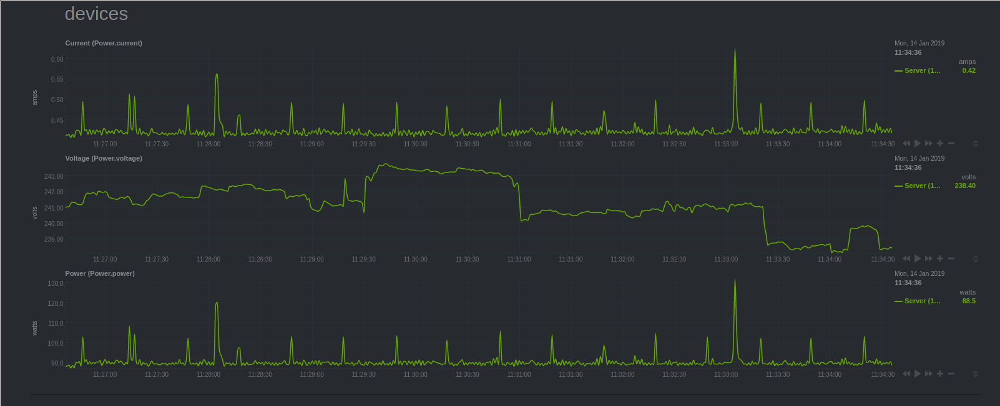

# netdata-pyHS100-module
A module for [Netdata](https://github.com/netdata/netdata) that probes emeter smartplugs for realtime power data.

Uses the [pyHS100](https://github.com/GadgetReactor/pyHS100) library.

# Requirements
- Netdata installed
- Python 3
- A compatible TP-Link Smart Plug with an E-Meter such as the HS110

# Installation for Ubuntu 18.04
1. Head on over to the pyHS100 repository and grab the source with Git.
2. Install the requirements using ``pip install -r requirements.txt``
3. Install some additional pip stuff ``pip install pytest pytest-cov voluptuous typing``
4. Install the pyHS100 library ``python setup.py install``
5. Download ``smart-plug-power.chart.py`` and put it into ``/usr/libexec/netdata/plugins.d``
6. Restart netdata ``service netdata restart``
7. After a few refreshes you should see a ``Power`` section appear in Netdata.
